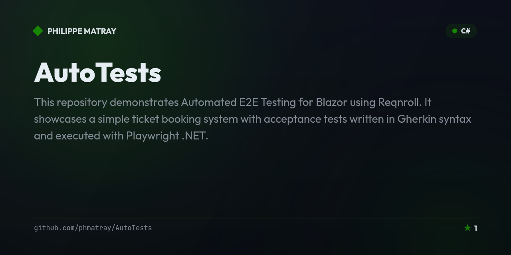

# Ticket Booking Demo Project 🎟️

<!-- portfolio-badges:start -->
<!-- Identity -->
[](https://github.com/phmatray/AutoTests)

[](https://github.com/phmatray/AutoTests/stargazers)
[](https://github.com/phmatray/AutoTests/network/members)
[](https://github.com/phmatray/AutoTests/blob/HEAD/LICENSE)

<!-- Activity -->
[](https://github.com/phmatray/AutoTests/issues)
[](https://github.com/phmatray/AutoTests/pulls)
[](https://github.com/phmatray/AutoTests/commits)
<!-- portfolio-badges:end -->


This repository demonstrates **Automated E2E Testing for Blazor using Reqnroll**. It showcases a simple ticket booking system with acceptance tests written in Gherkin syntax and executed with Playwright .NET.

---

## Table of Contents

- [Features 🚀](#features-)
- [Prerequisites ⚙️](#prerequisites-)
- [Getting Started 🔧](#getting-started-)
- [Usage 🚀](#usage-)
- [Running the Application 🚀](#running-the-application-)
- [Running the Tests 🧪](#running-the-tests-)
- [Project Structure 📂](#project-structure-)
- [Roadmap 🗺️](#roadmap-)
- [Contributing 🤝](#contributing-)
- [License 📄](#license-)

---

## Features 🚀

- **Event Listing:** Displays a list of upcoming events.
- **Event Details:** Shows detailed information for each event.
- **Ticket Booking:** Allows users to book tickets by entering their name.
- **Automated Acceptance Tests:** Validates key user flows using Gherkin-based specifications with Reqnroll and Playwright .NET.

---

## Prerequisites ⚙️

- [.NET 9 SDK](https://dotnet.microsoft.com/download/dotnet/9.0) or later

---

## Getting Started 🔧

1. **Clone the Repository**

   ```bash
   git clone https://github.com/phmatray/AutoTests.git
   cd AutoTests
   ```

2. **Restore .NET Packages**

   From the solution directory, run:

   ```bash
   dotnet restore
   ```
   
3. **Install Playwright Browsers**

   Navigate to the test project directory and install the required browsers:

   ```bash
   cd TicketBookingApp.EndToEndTests
   pwsh bin/Debug/net9.0/playwright.ps1 install
   ```

4**Project Configuration**

   The test project uses the following `csproj` configuration:

   ```xml
   <Project Sdk="Microsoft.NET.Sdk">

     <PropertyGroup>
       <TargetFramework>net9.0</TargetFramework>
     </PropertyGroup>

     <ItemGroup>
       <PackageReference Include="Microsoft.NET.Test.Sdk" Version="17.13.0" />
       <PackageReference Include="Microsoft.Playwright" Version="1.51.0" />
       <PackageReference Include="Reqnroll.NUnit" Version="2.4.0"/>
       <PackageReference Include="nunit" Version="4.3.2" />
       <PackageReference Include="NUnit3TestAdapter" Version="5.0.0" />
       <PackageReference Include="Shouldly" Version="4.3.0"/>
     </ItemGroup>

   </Project>
   ```

---

## Usage 🚀

Once the packages are restored, run the Blazor server app and browse the demo booking flow:

```bash
cd TicketBookingApp
dotnet run
```

Open `http://localhost:5140/` to see the list of events (`EventService` seeds three in-memory events), drill into an event's details page, and book a ticket by entering a name and confirming. The detailed steps for running the app and its Reqnroll/Playwright acceptance suite are below.

---

## Running the Application 🚀

1. **Navigate to the Blazor Project Directory**

   ```bash
   cd TicketBookingApp
   ```

2. **Run the Blazor Server Application**

   ```bash
   dotnet run
   ```

3. **Access the Application**

   Open your browser and navigate to `http://localhost:5140/` (or the URL provided by your console) to view the ticket booking system.

---

## Running the Tests 🧪

1. **Ensure the Blazor Application Is Running**

   Start the Blazor app as described above.

2. **Navigate to the Test Project Directory**

   ```bash
   cd TicketBookingApp.EndToEndTests
   ```

3. **Run the Test Suite**

   ```bash
   dotnet test
   ```

The acceptance tests are written in Gherkin and located in the `/features` folder. Here’s an example of the feature file:

```gherkin
Feature: Ticket Booking System
  As a user,
  I want to view available events and book tickets,
  So that I can attend an event.

  Scenario: Home page lists available events
    Given I navigate to the home page
    Then I should see a list of events

  Scenario: Event details are displayed correctly
    Given I navigate to the event details page for event with id 1
    Then I should see the event title "Rock Concert"

  Scenario: Booking a ticket successfully
    Given I navigate to the booking page for event with id 1
    When I enter "John Doe" into the "User Name" field
    And I click on "Confirm Booking"
    Then I should see a confirmation message "Booking Confirmed"
```

---

## Project Structure 📂

```
/TicketBookingApp
├── Models/                 // Data models (e.g., Event.cs)
├── Pages/                  // Blazor pages (Index.razor, EventDetails.razor, Booking.razor)
├── Services/               // Application services (e.g., EventService.cs)
└── Program.cs              // Application entry point

/TicketBookingApp.EndToEndTests
├── Features/               // Gherkin feature files (e.g., TicketBooking.feature)
├── Hooks/                  // Playwright setup and teardown hooks
├── Pages/                  // Page object models (Home, Event Details, Booking pages)
├── StepDefinitions/        // Reqnroll/SpecFlow step definitions binding Gherkin to Playwright
└── TicketBooking.feature   // Acceptance tests in Gherkin syntax
```

---

<!-- portfolio-techstack:start -->

## Tech Stack

- **.NET 10**
- Microsoft.Playwright
- Reqnroll.xUnit
- xunit.v3
- xunit.runner.visualstudio
- Shouldly

<!-- portfolio-techstack:end -->

## Roadmap 🗺️

- [ ] Add a GitHub Actions workflow to run the Reqnroll/Playwright suite automatically on every push and PR
- [ ] Replace the in-memory `EventService` with persistent storage (e.g. EF Core + a real database)
- [ ] Add form validation and error handling to the booking flow (e.g. empty name, duplicate bookings)
- [ ] Extend the Gherkin feature set with negative/edge-case scenarios (invalid event id, cancellations)
- [ ] Add a booking cancellation / management page

See the [open issues](https://github.com/phmatray/AutoTests/issues) for details and to propose new ideas.

## Contributing 🤝

Contributions are welcome! If you have suggestions, bug fixes, or new features, please open an issue or submit a pull request.  
**Maintainer:** [phmatray](https://github.com/phmatray)

---

## License 📄

This project is licensed under the MIT License. See the [LICENSE](LICENSE) file for more details.

---

Happy coding and testing! 🎉

<!-- portfolio-nugetkeep:start -->
---
Built by [Atypical Consulting](https://www.atypical.consulting). We also make
[NuGetKeep](https://nugetkeep.com/?utm_source=github-readme&utm_medium=readme&utm_campaign=launch-2026-07),
a self-hosted NuGet server with supply-chain quarantine.
<!-- portfolio-nugetkeep:end -->
